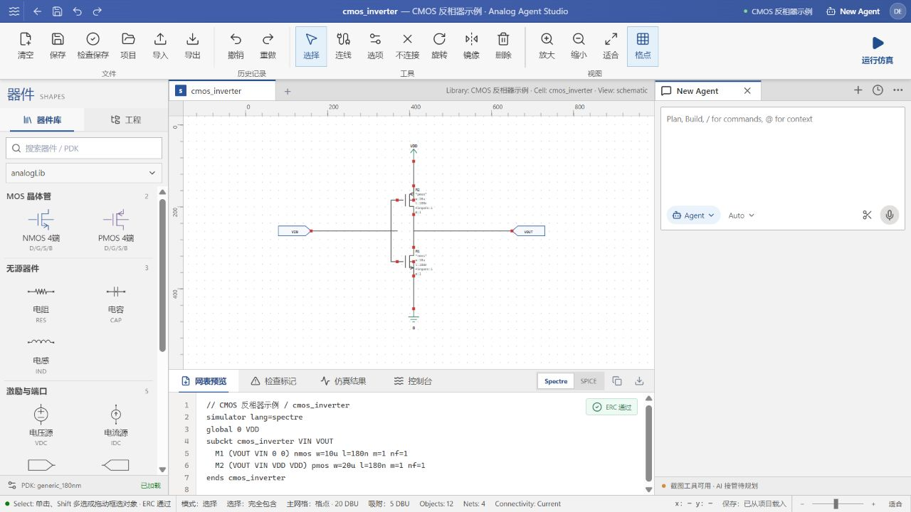

# Analog Agent Studio

我们的目标是打造一款天然具备 Agent 逻辑的原理图编辑工具，颠覆传统的 Analog IC 设计范式。



## 局域网部署

本项目带账户数据库，因此部署版必须由 Wrangler 本地运行时注入 D1；不能使用普通的 `vinext start`。

需要 Node.js 22.13 或更高版本。一键准备独立部署目录：

```powershell
npm run deploy:lan
```

默认结果：

```text
../analog-agent-studio-lan/
├─ app/                 Git 管理的独立部署克隆
├─ data/wrangler/       账户和项目数据库，升级时不会覆盖
├─ logs/
└─ backups/
```

进入部署版并启动：

```powershell
cd ..\analog-agent-studio-lan\app
npm run start:lan
```

脚本会先应用未执行的数据库迁移，再监听 `0.0.0.0:3000`。同一局域网中的设备访问：

```text
http://部署电脑的局域网IPv4地址:3000
```

也可以显式指定端口和持久化位置：

```powershell
powershell -ExecutionPolicy Bypass -File .\scripts\start-lan.ps1 `
  -Port 3000 `
  -DataPath "C:\AnalogAgentStudioData\wrangler"
```

Windows 防火墙需单独允许 TCP 3000，只建议为“专用网络 / 本地子网”放行；部署脚本不会自动修改系统安全设置。

当前 `Wrangler Local + D1` 适合局域网内测和 MVP。若作为长期正式服务，应迁移到本机 SQLite/PostgreSQL，并配置进程守护、定时备份和 HTTPS；局域网 HTTP 不应承载高价值真实密码。

## 局域网版本更新流程

公开仓库是开发源，部署目录是它的 Git 克隆。后续更新建议：

```powershell
git pull --ff-only
# 先在正在运行 start:lan 的终端按 Ctrl+C 停止旧版本
npm run deploy:lan
npm run start:lan --prefix ..\analog-agent-studio-lan\app
```

`deploy:lan` 会拒绝没有提交或仍有未提交修改的源仓库，避免部署版悄悄漏掉代码。它对已有部署执行 `git pull --ff-only`、`npm ci` 和生产构建；数据库、日志和环境文件不进入 Git。Windows 下更新前需要先停止旧服务，避免运行中的 Node/Workerd 锁住依赖文件。

## 许可证

本项目采用 [MIT License](LICENSE)。第三方符号资源的许可声明见 [`THIRD_PARTY_NOTICES.md`](THIRD_PARTY_NOTICES.md)。
